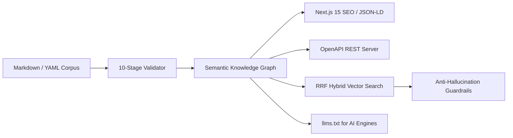

<div align="center">

# 🧠 GeoCore — AI-Native Knowledge Operating System

**Structure, validate, search, and distribute authoritative domain knowledge with zero hallucinations.**

[](https://opensource.org/licenses/MIT)
[](https://www.typescriptlang.org/)
[-brightgreen?style=flat-square&logo=vitest&logoColor=white)](https://vitest.dev/)
[](https://nodejs.org/)
[-orange?style=flat-square)](https://github.com/mormox2/GeoCore)
[](https://llmstxt.org)

<p align="center">
  <a href="#-quick-start"><b>Quick Start</b></a> •
  <a href="#-key-features"><b>Key Features</b></a> •
  <a href="#-architecture--packages"><b>Packages</b></a> •
  <a href="#-the-problem-geocore-solves"><b>Why GeoCore?</b></a> •
  <a href="#-ai-grounding--anti-hallucination"><b>Grounding Engine</b></a> •
  <a href="#-hybrid-search-rrf"><b>Hybrid Search</b></a> •
  <a href="https://github.com/mormox2/GeoCore/tree/main/docs"><b>Documentation</b></a>
</p>

---

</div>

## 💡 What is GeoCore?

**GeoCore** is an authoritative **Knowledge Operating System (Knowledge OS)** engineered for high-stakes domains (*Healthcare, Clinical Dentistry, Agritech, Legal, B2B Compliance*).

It takes your structured Markdown/YAML files and transforms them into an interconnected, mathematically grounded knowledge network that feeds **websites, REST APIs, vector search engines, and AI/RAG models** simultaneously.

> **Mission**: Build authoritative knowledge once. Validate it strictly. Deliver it everywhere without hallucinations.

---

## ⚡ The Problem GeoCore Solves

| Challenge in Traditional AI / CMS | GeoCore AI-Native Solution |
|---|---|
| ❌ **LLM Hallucinations** in medical/legal answers | ✅ **Deterministic Grounding Guardrails** validating answers against certified evidence (*PubMed, WHO, HAS, ISO*). |
| ❌ **Vector Search Blindspots** (fails on exact IDs, medical acronyms) | ✅ **Pure TypeScript Hybrid Search (RRF)** combining lexical **BM25** and dense **Embeddings**. |
| ❌ **Scattered, Unstructured Docs** | ✅ **10-Stage Semantic Validation Pipeline** with Zod schema enforcement & graph relationship checks. |
| ❌ **Invisible to AI Search Engines** | ✅ **Generative Engine Optimization (GEO)** auto-generating `llms.txt`, `llms-full.txt`, and rich **Schema.org JSON-LD**. |
| ❌ **Complex Python/C++ RAG setups** | ✅ **100% Pure TypeScript / Node.js Monorepo** — runs in edge functions, Next.js, or lightweight Docker containers. |

---

## 🚀 Quick Start

### Try in 30 Seconds with CLI

```bash
# 1. Initialize a new GeoCore Knowledge Base
npx @mormo_mossaab/geocore-cli init my-knowledge-base

# 2. Launch the interactive Visual Studio (2D Graph + Editor + RAG Tester)
cd my-knowledge-base
npx @mormo_mossaab/geocore-cli studio
```

### Full Monorepo Setup (From Source)

```bash
# Clone and install dependencies
git clone https://github.com/mormox2/GeoCore.git
cd GeoCore
npm install

# Build all 7 packages
npm run build

# Run the full QA test suite (747 tests, 100% passing)
npm test
```

---

## 🌟 Key Features



### 1. 🛡️ Zero-Hallucination & Clinical Grounding
GeoCore inspects synthesized LLM answers against verified source documents. If an answer asserts clinical claims unsupported by citations, GeoCore detects and flags the hallucination risk (`low`, `medium`, `high`) before it reaches patients or end-users.

```typescript
import { verifyAnswerGrounding } from "@mormo_mossaab/geocore-ai";

const evaluation = verifyAnswerGrounding(
  "Fluoride varnish should be applied at 5% concentration (WHO guidelines).",
  ragContext
);

console.log(evaluation.hallucinationRisk); // "low"
console.log(evaluation.isGrounded);        // true
```

### 2. ⚡ Pure TypeScript Hybrid Search (Reciprocal Rank Fusion)
Eliminates search misses by fusing keyword exact-matches (BM25) and dense semantic vectors (64D local or 1536D OpenAI):

$$RRF(d) = \frac{w_{\text{lexical}}}{60 + \text{rank}_{\text{lexical}}(d)} + \frac{w_{\text{vector}}}{60 + \text{rank}_{\text{vector}}(d)}$$

- **Query Latency**: `< 2ms` in-memory.
- **No external vector database required** for datasets up to 100,000+ chunks.

### 3. 🌐 Generative Engine Optimization (GEO) & Next.js 15 App Router
Turn your knowledge graph into an AI-crawlable, SEO-dominant digital presence with zero boilerplate:

```typescript
// app/api/geocore/[...route]/route.ts
import { createGeoCoreRouteHandlers } from "@mormo_mossaab/geocore-next";
import { myDataset } from "@/lib/dataset";

export const { GET, OPTIONS } = createGeoCoreRouteHandlers({
  dataset: myDataset,
  siteUrl: "https://yourdomain.com",
});
```

### 4. 🎨 Interactive Visual Studio
A lightweight, built-in development studio featuring:
- **Interactive 2D Knowledge Graph Explorer**
- **Live Markdown & YAML Frontmatter Editor** with real-time diagnostic linting
- **RAG Playground** to test vector similarity and hybrid search queries live

---

## 📦 Architecture & Packages

GeoCore is organized as an enterprise-grade, clean monorepo with 7 decoupled packages:

| Package | Version | Role | Key Technologies |
|---|---|---|---|
| [`@mormo_mossaab/geocore`](./packages/geocore) | `1.0.0` | Domain core, Zod schemas, 10-stage validator, graph & static export. | `zod` |
| [`@mormo_mossaab/geocore-cli`](./packages/geocore-cli) | `1.0.0` | CLI tool (`init`, `validate`, `export`, `inspect`, `serve`, `studio`). | `zod`, `commander` |
| [`@mormo_mossaab/geocore-vector`](./packages/geocore-vector) | `1.0.0` | Vector embeddings, in-memory cosine store & RRF hybrid search. | TypeScript, Cosine Math |
| [`@mormo_mossaab/geocore-ai`](./packages/geocore-ai) | `1.0.0` | RAG context builder, semantic chunking & anti-hallucination guardrails. | Zod, Grounding Engine |
| [`@mormo_mossaab/geocore-server`](./packages/geocore-server) | `1.0.0` | Standalone REST server with OpenAPI 3.1 & API key authentication. | Node HTTP, OpenAPI |
| [`@mormo_mossaab/geocore-next`](./packages/geocore-next) | `1.0.0` | Next.js 14+/15+ App Router helpers, metadata & JSON-LD injectors. | Next.js, React |
| [`@mormo_mossaab/geocore-db`](./packages/geocore-db) | `1.0.0` | Persistence repository layer with In-Memory & SQLite adapters. | SQLite, Memory DB |

---

## 🛡️ 10-Stage Validation Pipeline

Every Knowledge Object is checked against 10 strict validation gates before release:

1. **Dataset Integrity** — ID collisions, manifest verification
2. **Object Invariants** — Frontmatter schema, required taxonomy
3. **Graph Topology** — Orphan detection, bidirectional relationship consistency
4. **Metadata Resolution** — Canonical URLs, OpenGraph, title/description invariants
5. **Route Mapping** — URL conflicts & deterministic slug mapping
6. **Search Indexing** — BM25 term weighting & full-text extraction
7. **Schema.org JSON-LD** — MedicalWebPage, FAQPage, Article compliance
8. **AI Readability** — Automatic generation of standard `llms.txt` and `llms-full.txt`
9. **Sitemap Generation** — Google-compliant XML sitemaps with image extensions
10. **Static Export Bundle** — Atomic build distribution

---

## 🧪 Benchmark & Test Suite Status

```txt
✓ @mormo_mossaab/geocore          (68 test files, 512 tests passed)
✓ @mormo_mossaab/geocore-cli      (8 test files, 19 tests passed)
✓ @mormo_mossaab/geocore-server   (1 test file, 14 tests passed)
✓ @mormo_mossaab/geocore-db       (1 test file, 6 tests passed)
✓ @mormo_mossaab/geocore-vector   (1 test file, 10 tests passed)
✓ @mormo_mossaab/geocore-next     (2 test files, 13 tests passed)
✓ @mormo_mossaab/geocore-ai       (1 test file, 6 tests passed)
─────────────────────────────────────────────────────────────
Total: 105 test suites, 747 tests — 100% Passed (0 Failures)
```

---

## 👥 Real-World Reference Examples

Explore battle-tested reference implementations in [`/examples`](./examples):
- **`rtimidental`**: Medical & Dental knowledge base with clinical citation grounding.
- **`dawajinpro`**: Agritech & Poultry ERP domain knowledge network.
- **`nextjs-app`**: Full-stack Next.js 15 app with RAG search and AI-ready metadata.

---

## 🤝 Contributing & Community

Contributions are welcome! Please check [CONTRIBUTING.md](./CONTRIBUTING.md) to get started.

- 💬 **Discussions & Support**: Open an [Issue](https://github.com/mormox2/GeoCore/issues) or start a Discussion on GitHub.
- 🚀 **Star the Repo**: If GeoCore helps your project, please give it a star!

---

## 📄 License

GeoCore is open-source software licensed under the **[MIT License](./LICENSE)**.  
Created by **[Dr Mossaab Rtimi (Mormox)](https://github.com/mormox2)**.
