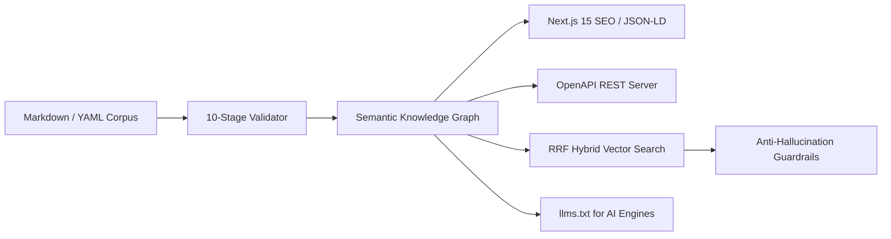

<div align="center">

# 🧠 GeoCore — AI-Native Knowledge Operating System

**Structure, validate, search, and distribute authoritative domain knowledge with zero hallucinations.**

[](https://opensource.org/licenses/MIT)
[](https://www.typescriptlang.org/)
[](https://vitest.dev/)
[](https://nodejs.org/)
[-orange?style=flat-square)](https://github.com/mormox2/GeoCore)
[](https://llmstxt.org)

<p align="center">
  <a href="#-quick-start"><b>Quick Start</b></a> •
  <a href="#-key-features"><b>Key Features</b></a> •
  <a href="#-architecture--packages"><b>Packages</b></a> •
  <a href="#-the-problem-geocore-solves"><b>Why GeoCore?</b></a> •
  <a href="#-ai-grounding--anti-hallucination"><b>Grounding Engine</b></a> •
  <a href="#-hybrid-search-rrf"><b>Hybrid Search</b></a> •
  <a href="https://github.com/mormox2/GeoCore/tree/main/docs"><b>Documentation</b></a>
</p>

---

</div>

## 💡 What is GeoCore?

**GeoCore** is an authoritative **Knowledge Operating System (Knowledge OS)** engineered for high-stakes domains (*Healthcare, Clinical Dentistry, Agritech, Legal, B2B Compliance*).

It takes your structured Markdown/YAML files and transforms them into an interconnected, mathematically grounded knowledge network that feeds **websites, REST APIs, vector search engines, and AI/RAG models** simultaneously.

> **Mission**: Build authoritative knowledge once. Validate it strictly. Deliver it everywhere without hallucinations.

---

## ⚡ The Problem GeoCore Solves

| Challenge in Traditional AI / CMS | GeoCore AI-Native Solution |
|---|---|
| ❌ **LLM Hallucinations** in medical/legal answers | ✅ **Deterministic Grounding Guardrails** validating answers against certified evidence (*PubMed, WHO, HAS, ISO*). |
| ❌ **Vector Search Blindspots** (fails on exact IDs, medical acronyms) | ✅ **Pure TypeScript Hybrid Search (RRF)** combining lexical **BM25** and dense **Embeddings**. |
| ❌ **Scattered, Unstructured Docs** | ✅ **10-Stage Semantic Validation Pipeline** with Zod schema enforcement & graph relationship checks. |
| ❌ **Invisible to AI Search Engines** | ✅ **Generative Engine Optimization (GEO)** auto-generating `llms.txt`, `llms-full.txt`, and rich **Schema.org JSON-LD**. |
| ❌ **Complex Python/C++ RAG setups** | ✅ **100% Pure TypeScript / Node.js Monorepo** — runs in edge functions, Next.js, or lightweight Docker containers. |

---

## 🚀 Quick Start

### Try in 30 Seconds with CLI

```bash
# 1. Initialize a new GeoCore Knowledge Base in the current directory
mkdir my-knowledge-base && cd my-knowledge-base
npx @mormo_mossaab/geocore-cli init

# 2. Launch the interactive Visual Studio (2D Graph + Editor + RAG Tester)
npx @mormo_mossaab/geocore-cli studio
```

### Full Monorepo Setup (From Source)

```bash
# Clone and install dependencies (Node.js >= 22.12)
git clone https://github.com/mormox2/GeoCore.git
cd GeoCore
npm ci

# Build all packages in dependency order
npm run build

# Run the full QA test suite
npm test
```

---

## 🌟 Key Features


```mermaid
graph LR
  MD[Markdown / YAML Corpus] --> VAL[10-Stage Validator]
  VAL --> GRAPH[Semantic Knowledge Graph]
  GRAPH --> WEB[Next.js 15 SEO / JSON-LD]
  GRAPH --> API[OpenAPI REST Server]
  GRAPH --> RAG[RRF Hybrid Vector Search]
  GRAPH --> GEO[llms.txt for AI Engines]
  RAG --> GUARD[Anti-Hallucination Guardrails]
```

### 1. 🛡️ Zero-Hallucination & Clinical Grounding
GeoCore checks every sentence of an answer against the certified evidence of the AI context package (object, entities, citations, sources). Sentences whose content is not supported by that evidence are returned in `unsupportedClaims`, and an answer containing any of them is not considered grounded.

```typescript
import { getAiContext } from "@mormo_mossaab/geocore";
import { verifyAnswerGrounding, buildExtractiveAnswer } from "@mormo_mossaab/geocore-ai";

const context = getAiContext(dataset, { objectId: "ko_detartrage_abime_dents" }).data!;

const evaluation = verifyAnswerGrounding(llmAnswer, context);
evaluation.isGrounded;        // false as soon as one claim is unsupported
evaluation.unsupportedClaims; // e.g. ["Le détartrage blanchit définitivement les dents."]
evaluation.hallucinationRisk; // "low" | "medium" | "high"

// Or answer only with sentences copied from the certified object:
const { answer } = buildExtractiveAnswer("Le détartrage abîme-t-il l'émail ?", context);
```

The check is lexical: it detects claims whose words are absent from the evidence, not subtle contradictions using the same words, so keep a human review for high-stakes content.

### 2. ⚡ Pure TypeScript Hybrid Search (Reciprocal Rank Fusion)
Eliminates search misses by fusing keyword exact-matches (BM25) and dense semantic vectors (64D local or 1536D OpenAI):

$$RRF(d) = \frac{w_{\text{lexical}}}{60 + \text{rank}_{\text{lexical}}(d)} + \frac{w_{\text{vector}}}{60 + \text{rank}_{\text{vector}}(d)}$$

- **Query Latency**: `< 2ms` in-memory.
- **No external vector database required** for datasets up to 100,000+ chunks.

### 3. 🌐 Generative Engine Optimization (GEO) & Next.js 15 App Router
Turn your knowledge graph into an AI-crawlable, SEO-dominant digital presence with zero boilerplate:

```typescript
// app/api/geocore/[...route]/route.ts
import { handleLlmsTxt, handleSitemapXml, handleSearchApi, handleContextApi } from "@mormo_mossaab/geocore-next";
import { myDataset } from "@/lib/dataset";

export async function GET(req: Request, { params }: { params: { route?: string[] } }) {
  const [first, second] = params.route ?? [];
  if (first === "llms.txt") return handleLlmsTxt(myDataset, { siteUrl: "https://yourdomain.com" });
  if (first === "sitemap.xml") return handleSitemapXml(myDataset, { siteUrl: "https://yourdomain.com" });
  if (first === "search") return handleSearchApi(myDataset, new URL(req.url).searchParams.get("q") ?? "");
  if (first === "context" && second) return handleContextApi(myDataset, second);
  return new Response("Not found", { status: 404 });
}
```

See [`examples/nextjs-app`](./examples/nextjs-app) for the complete route, including the grounded `answer` endpoint used by the widget.

### 4. 🎨 Interactive Visual Studio
A lightweight, built-in development studio featuring:
- **Interactive 2D Knowledge Graph Explorer**
- **Live Markdown & YAML Frontmatter Editor** with real-time diagnostic linting
- **RAG Playground** to test vector similarity and hybrid search queries live

### 5. 💬 Embeddable Widget
Add a grounded assistant to any site. The widget calls the `/answer` endpoint of `geocore serve` (or of your Next.js route), shows answers extracted from your published knowledge with their sources and grounding score, and says so when no verified answer exists:

```html
<script type="module" src="https://cdn.jsdelivr.net/npm/@mormo_mossaab/geocore/dist/widget/geocore-widget.js"></script>
<geocore-widget data-api-url="https://your-geocore-server.example/api" data-language="fr"></geocore-widget>
```

### 6. 🔐 Standalone API Server
`geocore serve` exposes the dataset over REST (OpenAPI at `/api/openapi.json`). Public routes only return published, public content; `?visibility=internal` and `/api/validate` require an API key, and `POST /api/vectorize` requires an admin key (`X-Api-Key` or `Authorization: Bearer`).

---

## 📦 Architecture & Packages

GeoCore is organized as an enterprise-grade, clean monorepo with 7 decoupled packages:

| Package | Version | Role | Key Technologies |
|---|---|---|---|
| [`@mormo_mossaab/geocore`](./packages/geocore) | `1.0.1` | Domain core, Zod schemas, 10-stage validator, graph & static export. | `zod` |
| [`@mormo_mossaab/geocore-cli`](./packages/geocore-cli) | `1.0.1` | CLI tool (`init`, `validate`, `export`, `inspect`, `serve`, `vectorize`, `studio`). | Node.js, bundled Studio |
| [`@mormo_mossaab/geocore-vector`](./packages/geocore-vector) | `1.0.1` | Vector embeddings, in-memory cosine store & RRF hybrid search. | TypeScript, Cosine Math |
| [`@mormo_mossaab/geocore-ai`](./packages/geocore-ai) | `1.0.1` | RAG context builder, semantic chunking, extractive answers & claim-level grounding checks. | Grounding Engine |
| [`@mormo_mossaab/geocore-server`](./packages/geocore-server) | `1.0.1` | Standalone REST server with OpenAPI 3.1, grounded `/api/answer` & API key authentication. | Node HTTP, OpenAPI |
| [`@mormo_mossaab/geocore-next`](./packages/geocore-next) | `1.0.1` | Next.js 14+/15+ App Router helpers, metadata & JSON-LD injectors. | Next.js |
| [`@mormo_mossaab/geocore-db`](./packages/geocore-db) | `1.0.1` | Persistence repository layer with In-Memory & SQLite adapters. | SQLite, Memory DB |

---

## 🛡️ 10-Stage Validation Pipeline

Every Knowledge Object is checked against 10 strict validation gates before release:

1. **Dataset Integrity** — ID collisions, manifest verification
2. **Object Invariants** — Frontmatter schema, required taxonomy
3. **Graph Topology** — Orphan detection, bidirectional relationship consistency
4. **Metadata Resolution** — Canonical URLs, OpenGraph, title/description invariants
5. **Route Mapping** — URL conflicts & deterministic slug mapping
6. **Search Indexing** — BM25 term weighting & full-text extraction
7. **Schema.org JSON-LD** — MedicalWebPage, FAQPage, Article compliance
8. **AI Readability** — Automatic generation of standard `llms.txt` and `llms-full.txt`
9. **Sitemap Generation** — Google-compliant XML sitemaps with image extensions
10. **Static Export Bundle** — Atomic build distribution

---

## 🧪 Benchmark & Test Suite Status

```txt
✓ @mormo_mossaab/geocore          (91 test files, 672 tests)
✓ @mormo_mossaab/geocore-ai       (1 test file, 13 tests)
✓ @mormo_mossaab/geocore-cli      (9 test files, 25 tests)
✓ @mormo_mossaab/geocore-db       (2 test files, 9 tests)
✓ @mormo_mossaab/geocore-next     (2 test files, 15 tests)
✓ @mormo_mossaab/geocore-server   (1 test file, 25 tests)
✓ @mormo_mossaab/geocore-vector   (1 test file, 12 tests)
✓ examples + site + studio        (5 test files, 77 tests)
─────────────────────────────────────────────────────────────
Total: 112 test files, 848 tests (October 2026)
```

---

## 👥 Real-World Reference Examples

Explore battle-tested reference implementations in [`/examples`](./examples):
- **`rtimidental`**: Medical & Dental knowledge base with clinical citation grounding.
- **`dawajinpro`**: Agritech & Poultry ERP domain knowledge network.
- **`nextjs-app`**: Full-stack Next.js 15 app with RAG search and AI-ready metadata.

---

## 🤝 Contributing & Community

Contributions are welcome! Please check [CONTRIBUTING.md](./CONTRIBUTING.md) to get started.

- 💬 **Discussions & Support**: Open an [Issue](https://github.com/mormox2/GeoCore/issues) or start a Discussion on GitHub.
- 🚀 **Star the Repo**: If GeoCore helps your project, please give it a star!

---

## 📄 License

GeoCore is open-source software licensed under the **[MIT License](./LICENSE)**.  
Created by **[Dr Mossaab Rtimi (Mormox)](https://github.com/mormox2)**.
