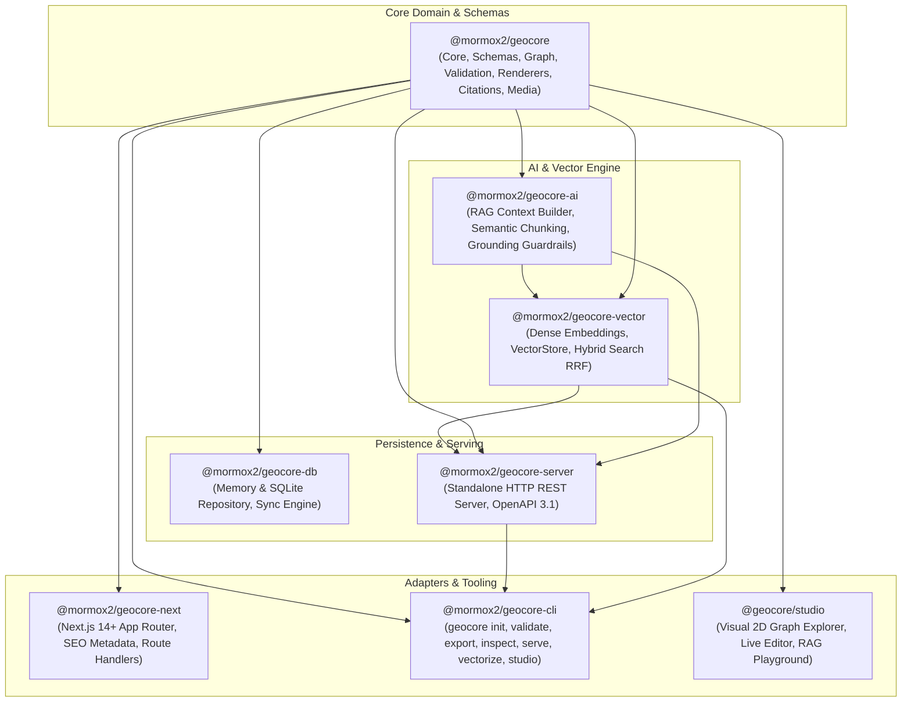
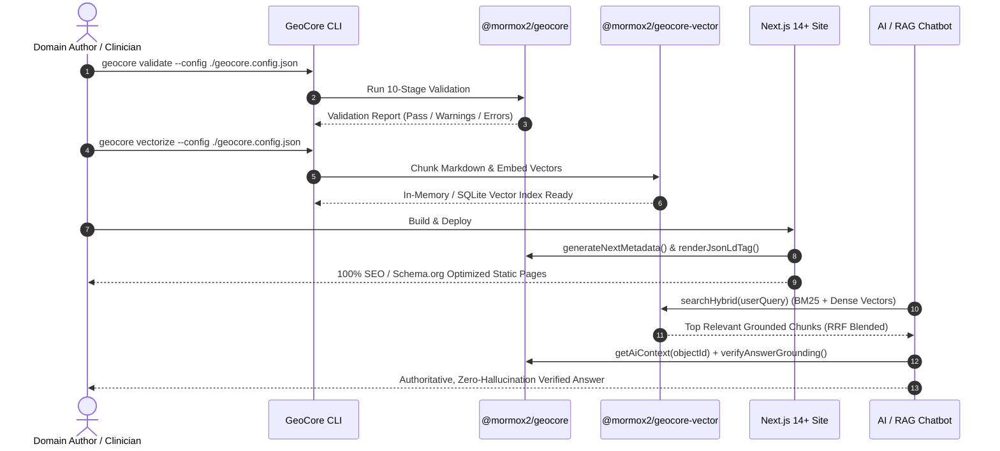

# GeoCore Architecture & System Overview

**GeoCore** is an authoritative, AI-native Knowledge Operating System that turns markdown domain files and relational metadata into validated, structured knowledge distributed across websites, REST APIs, search engines, and AI/RAG systems.

---

## 🏛️ Monorepo Package Topology

---

## 💎 Core Domain Entities

1. **Knowledge Object (`KnowledgeObject`)**:
   - Fundamental atomic unit of domain knowledge.
   - Contains Markdown body, YAML frontmatter, slug, language, status (`draft`, `review`, `published`, `deprecated`), and visibility (`public`, `internal`, `private`).
2. **Entity (`Entity`)**:
   - Domain concept (e.g. *Gingivite*, *Détartrage*, *Infection respiratoire aviaire*).
   - Classified by type (`concept`, `medical_condition`, `procedure`, `disease`, `treatment`).
3. **Relationship (`Relationship`)**:
   - Directed typed edge connecting knowledge objects and entities (`explains`, `treats`, `prevents`, `requires`, `subtopic-of`, `variant-of`).
4. **Citation & Source (`Citation`, `Source`)**:
   - Formal evidence backing domain statements with verified URLs, DOIs, PMIDs, and trust levels (`authoritative`, `peer-reviewed`, `institutional`, `clinical-consensus`).
5. **Media (`Media`)**:
   - Validated imagery, diagrams, and video assets with license, aspect ratio, captions, and accessibility alt text.

---

## 🛡️ 10-Stage Validation Pipeline

Every knowledge repository undergoes a strict 10-stage sequential validation before export or publishing:

| Stage | Name | Checks performed |
|---|---|---|
| **1** | `dataset` | Dataset manifest validity, ID format, mandatory site name and metadata. |
| **2** | `knowledge-objects` | Frontmatter schema validity (Zod), non-empty summary, author, valid slug, language. |
| **3** | `relationships` | Reference integrity (both source and target exist), cycle detection, orphan node warnings. |
| **4** | `metadata` | Resolved metadata integrity, canonical URLs for published items, trust level verification. |
| **5** | `routes` | Route collisions, duplicate paths, multi-lingual slug conflicts. |
| **6** | `search` | Search document generation, keyword extraction, snippet indexing. |
| **7** | `schema` | Schema.org JSON-LD generation (`Article`, `MedicalWebPage`, `DefinedTerm`, `BreadcrumbList`). |
| **8** | `llms` | `llms.txt` and `llms-full.txt` markdown bundle generation for AI scrapers. |
| **9** | `sitemap` | XML sitemap syntax, priority, changefreq, and public URL filtering. |
| **10** | `static-export` | End-to-end static asset generation and bundle manifest validation. |

---

## ⚡ Data Flow Architecture

