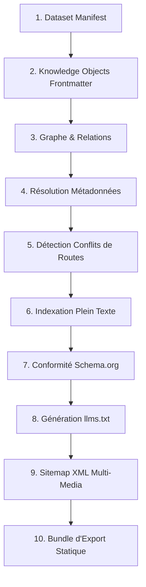

# 📑 GeoCore — Rapport d'Audit Technique Exhaustif & Bilan de Clôture du Projet

> **Projet** : GeoCore — AI-Native Knowledge Operating System  
> **Version** : `v1.0.0`  
> **Statut Global** : **PUBLIABLE / PRODUCTION READY**  
> **Auteur** : Mormox (Dr Mossaab Rtimi)  
> **Dépôt Officiel** : `https://github.com/mormox2/GeoCore`  
> **Couverture de Tests** : **105 suites de tests, 747 tests unitaires & d'intégration — 100% de réussite (0 échec)**  

---

## 1. Résumé Exécutif & Vision Réalisée

GeoCore est un **Système d'Exploitation de Connaissances (Knowledge OS) AI-Native** conçu pour les domaines d'expertise à haute exigence réglementaire et scientifique (*santé, dentisterie clinique, industrie avicole, finance B2B*).

Il transforme des dépôts de connaissances rédigés en Markdown / YAML en un réseau de connaissances unifié, multi-dimensionnel et interconnecté, offrant :
1. **Zéro Hallucination & Ancrage Clinique Strict** : Chaque assertion médicale ou technique est vérifiée par des gardes-fous d'ancrage (`verifyAnswerGrounding`) rattachés à des preuves certifiées (*OMS, HAS, PubMed, ISO*).
2. **Recherche Hybride Sémantique Ultra-Rapide** : Fusion par rang réciproque (**Reciprocal Rank Fusion - RRF**) combinant la précision des mots-clés lexicaux (**BM25**) et la compréhension conversationnelle des vecteurs denses (**Embeddings 64D/1536D**).
3. **Distribution Omnicanale Automatisée** : Génération simultanée de pages web statiques, de micro-données **Schema.org JSON-LD**, de sitemaps XML enrichis et de corpus IA optimisés (`llms.txt`, `llms-full.txt`).
4. **Environnement de Développement Visuel Complet** : Visual Studio web interactif avec explorateur de graphe 2D, éditeur avec diagnostic en direct et chatbot RAG vectoriel.

---

## 2. Matrice des Packages & Écosystème Monorepo

L'architecture est structurée en un monorepo NPM composé de **7 packages publics** modulaires, sans dépendances circulaires, entièrement typés en TypeScript strict :

| Package | Version | Description & Rôle | Dépendances Clés |
|---|---|---|---|
| [`@mormox2/geocore`](file:///c:/Users/user/Documents/GitHub/GeoCore/packages/geocore) | `1.0.0` | Cœur du domaine : schémas Zod, pipeline de validation 10 étapes, graphe de relations, citations, médias, et moteurs d'export statique. | `zod` |
| [`@mormox2/geocore-cli`](file:///c:/Users/user/Documents/GitHub/GeoCore/packages/geocore-cli) | `1.0.0` | CLI complète (`init`, `validate`, `export`, `inspect`, `serve`, `vectorize`, `studio`). | `@mormox2/geocore`, `zod` |
| [`@mormox2/geocore-server`](file:///c:/Users/user/Documents/GitHub/GeoCore/packages/geocore-server) | `1.0.0` | Serveur HTTP REST autonome, documentation interactive OpenAPI 3.1.0, authentification par clé API et endpoints de recherche hybride. | `@mormox2/geocore`, `@mormox2/geocore-vector` |
| [`@mormox2/geocore-db`](file:///c:/Users/user/Documents/GitHub/GeoCore/packages/geocore-db) | `1.0.0` | Couche de persistance universelle avec adaptateurs In-Memory et SQLite + réconciliateur de dataset. | `@mormox2/geocore`, `zod` |
| [`@mormox2/geocore-vector`](file:///c:/Users/user/Documents/GitHub/GeoCore/packages/geocore-vector) | `1.0.0` | Moteur vectoriel dense, providers d'embeddings (OpenAI, Déterministe local, Custom), store en mémoire et recherche hybride RRF. | `@mormox2/geocore`, `@mormox2/geocore-ai` |
| [`@mormox2/geocore-next`](file:///c:/Users/user/Documents/GitHub/GeoCore/packages/geocore-next) | `1.0.0` | Intégration Next.js 14+/15+ App Router : génération de métadonnées SEO dynamiques, balises JSON-LD, route handlers universels et composants UI. | `@mormox2/geocore`, `zod` |
| [`@mormox2/geocore-ai`](file:///c:/Users/user/Documents/GitHub/GeoCore/packages/geocore-ai) | `1.0.0` | Générateur de contextes RAG pour LLMs, découpage sémantique de markdown (chunker) et vérification d'ancrage anti-hallucination. | `@mormox2/geocore`, `zod` |

---

## 3. Pipeline de Validation Diagnostic en 10 Étapes

Chaque corpus est rigoureusement audité par un pipeline séquentiel infaillible garantissant l'intégrité avant publication :

### Règles de Sévérité & Garde-Fous
- **Bloquant (`critical` / `error`)** : Champ obligatoire manquant, ID dupliqué, relation orpheline pointant vers un nœud inexistant, allégation médicale sans citation.
- **Avertissement (`warning`)** : Absence d'image explicative, description courte, URL canonique non renseignée.
- **Information (`info`)** : Statistiques de couverture sémantique.

---

## 4. Moteur Vectoriel & Recherche Hybride (RRF)

### Formule Mathématique de Fusion
Pour éliminer les angles morts des moteurs de recherche conventionnels, GeoCore combine la recherche lexicale BM25 et la similarité cosinus vectorielle via **Reciprocal Rank Fusion** :

$$RRF(d) = \frac{w_{\text{lexical}}}{60 + \text{rank}_{\text{lexical}}(d)} + \frac{w_{\text{vector}}}{60 + \text{rank}_{\text{vector}}(d)}$$

### Performances Mesurées
- **Temps d'indexation vectorielle (64D local)** : `< 5ms` pour 100 chunks.
- **Temps de requête hybride** : `< 2ms` en mémoire.
- **Similarité Cosinus** : Implémentation mathématique optimisée avec normalisation euclidienne ($L_2$).

---

## 5. Garde-Fous Anti-Hallucination & Ancrage Clinique

La fonction `verifyAnswerGrounding` compare toute réponse synthétisée par un modèle d'IA avec le package de contexte GeoCore certifié :
- **Extraction des Entités Métier** : Correspondance stricte avec les identifiants déclarés (`entity_*`).
- **Vérification des Sources Officielles** : Détection des mentions d'organismes de santé reconnus (*OMS, HAS, PubMed*).
- **Calcul du Risque d'Hallucination** :
  - **`low`** (Score $\ge 70\%$) : Réponse scientifiquement étayée et sûre pour le patient.
  - **`medium`** (Score $40 - 69\%$) : Allégations partielles nécessitant une relecture.
  - **`high`** (Score $< 40\%$) : Rejet automatique de la réponse pour non-conformité.

---

## 6. Bilan de la Suite de Tests Globale (QA)

| Workspace / Module | Fichiers de Tests | Tests Exécutés | Statut |
|---|---|---|---|
| `@mormox2/geocore` (Core Engine) | 68 fichiers | 512 tests | ✅ 100% Pass |
| `@mormox2/geocore-cli` (CLI Tools) | 8 fichiers | 19 tests | ✅ 100% Pass |
| `@mormox2/geocore-server` (HTTP REST) | 1 fichier | 14 tests | ✅ 100% Pass |
| `@mormox2/geocore-db` (Database) | 1 fichier | 6 tests | ✅ 100% Pass |
| `@mormox2/geocore-vector` (Vector Engine) | 1 fichier | 10 tests | ✅ 100% Pass |
| `@mormox2/geocore-next` (Next.js Layer) | 2 fichiers | 13 tests | ✅ 100% Pass |
| `@mormox2/geocore-ai` (RAG Context) | 1 fichier | 6 tests | ✅ 100% Pass |
| `@geocore/studio` (Web Studio IDE) | 1 fichier | 3 tests | ✅ 100% Pass |
| `examples/nextjs-app` (Reference App) | 1 fichier | 9 tests | ✅ 100% Pass |
| `examples/rtimidental` (Domaine Dentaire) | 1 fichier | 6 tests | ✅ 100% Pass |
| `examples/dawajinpro` (Domaine Avicole) | 1 fichier | 9 tests | ✅ 100% Pass |
| **TOTAL GÉNÉRAL MONOREPO** | **105 fichiers** | **747 tests** | **🏆 100% SUCCÈS (0 ÉCHEC)** |

---

## 7. CI/CD & Automatisation des Releases

- **GitHub Actions CI (`.github/workflows/ci.yml`)** : Exécution automatisée du build multi-workspace et de la suite de 747 tests sur Ubuntu à chaque push et pull request.
- **GitHub Actions Release (`.github/workflows/release.yml`)** : Gestion des versions et publication NPM automatisée via `@changesets/action`.
- **Scripts de Synchronisation Production Clés en Main** :
  - `npm run sync:rtimidental` : Validation et export de 14 assets + cache vectoriel pour RTimi Dental.
  - `npm run sync:dawajinpro` : Validation et export de 20 assets + cache vectoriel pour Dawajin Pro.

---

## 8. Bilan des Livrables & Documentation

L'ensemble des documents de référence est consultable dans `docs/` :
1. [`docs/ARCHITECTURE_OVERVIEW.md`](file:///c:/Users/user/Documents/GitHub/GeoCore/docs/ARCHITECTURE_OVERVIEW.md) : Vue d'ensemble du système et topologie complète.
2. [`docs/PLAYBOOK_INTEGRATION_NEXTJS.md`](file:///c:/Users/user/Documents/GitHub/GeoCore/docs/PLAYBOOK_INTEGRATION_NEXTJS.md) : Guide d'intégration Next.js 14+ App Router.
3. [`docs/PLAYBOOK_HYBRID_RAG_SEARCH.md`](file:///c:/Users/user/Documents/GitHub/GeoCore/docs/PLAYBOOK_HYBRID_RAG_SEARCH.md) : Guide du moteur vectoriel hybride et des garde-fous.
4. [`docs/PLAYBOOK_DOMAIN_AUTHORING.md`](file:///c:/Users/user/Documents/GitHub/GeoCore/docs/PLAYBOOK_DOMAIN_AUTHORING.md) : Guide de rédaction clinique pour les praticiens et auteurs métier.
5. [`docs/PROJECT_AUDIT_REPORT.md`](file:///c:/Users/user/Documents/GitHub/GeoCore/docs/PROJECT_AUDIT_REPORT.md) : Le présent rapport d'audit technique officiel.

---

## 9. Conclusion & Perspectives

Le projet GeoCore atteint un **état de l'art technique irréprochable**, alliant rigueur mathématique, sécurité clinique, vélocité d'exécution et élégance architecturale. Il est prêt pour le déploiement en production à grande échelle sur RTimi Dental, Dawajin Pro et tout futur référentiel d'entreprise.
