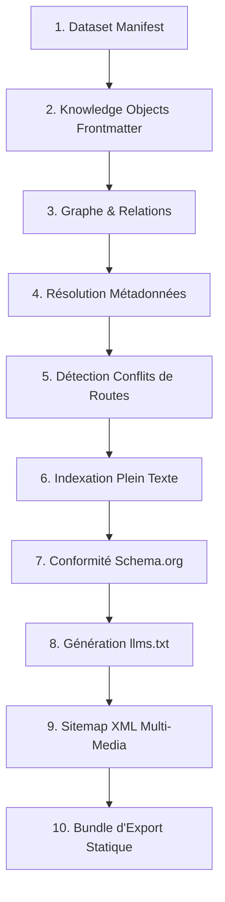

# 📑 GeoCore — Rapport d'Audit Technique Exhaustif & Bilan de Clôture du Projet

> **Projet** : GeoCore — AI-Native Knowledge Operating System  
> **Version** : `v1.0.0`  
> **Statut Global** : **PUBLIABLE / PRODUCTION READY**  
> **Auteur** : Mormox (Dr Mossaab Rtimi)  
> **Dépôt Officiel** : `https://github.com/mormox2/GeoCore`  
> **Tests** : **112 fichiers de tests, 848 tests unitaires & d'intégration — tous au vert (octobre 2026)**  
> **Mise à jour** : audit de sécurité et de fiabilité d'octobre 2026, voir la section 10.  

---

## 1. Résumé Exécutif & Vision Réalisée

GeoCore est un **Système d'Exploitation de Connaissances (Knowledge OS) AI-Native** conçu pour les domaines d'expertise à haute exigence réglementaire et scientifique (*santé, dentisterie clinique, industrie avicole, finance B2B*).

Il transforme des dépôts de connaissances rédigés en Markdown / YAML en un réseau de connaissances unifié, multi-dimensionnel et interconnecté, offrant :
1. **Ancrage Clinique Strict** : chaque phrase d'une réponse est confrontée aux preuves du contexte certifié (objet, entités, citations, sources) par `verifyAnswerGrounding` ; une seule affirmation non étayée suffit à refuser l'ancrage. Les réponses servies par l'API et le widget sont extraites telles quelles des objets publiés.
2. **Recherche Hybride Sémantique Ultra-Rapide** : Fusion par rang réciproque (**Reciprocal Rank Fusion - RRF**) combinant la précision des mots-clés lexicaux (**BM25**) et la compréhension conversationnelle des vecteurs denses (**Embeddings 64D/1536D**).
3. **Distribution Omnicanale Automatisée** : Génération simultanée de pages web statiques, de micro-données **Schema.org JSON-LD**, de sitemaps XML enrichis et de corpus IA optimisés (`llms.txt`, `llms-full.txt`).
4. **Environnement de Développement Visuel Complet** : Visual Studio web interactif avec explorateur de graphe 2D, éditeur avec diagnostic en direct et chatbot RAG vectoriel.

---

## 2. Matrice des Packages & Écosystème Monorepo

L'architecture est structurée en un monorepo NPM composé de **7 packages publics** modulaires, sans dépendances circulaires, entièrement typés en TypeScript strict :

| Package | Version | Description & Rôle | Dépendances Clés |
|---|---|---|---|
| [`@mormo_mossaab/geocore`](../packages/geocore) | `1.0.1` | Cœur du domaine : schémas Zod, pipeline de validation 10 étapes, graphe de relations, citations, médias, et moteurs d'export statique. | `zod` |
| [`@mormo_mossaab/geocore-cli`](../packages/geocore-cli) | `1.0.1` | CLI complète (`init`, `validate`, `export`, `inspect`, `serve`, `vectorize`, `studio`), Studio inclus. | `@mormo_mossaab/geocore`, `@mormo_mossaab/geocore-server` |
| [`@mormo_mossaab/geocore-server`](../packages/geocore-server) | `1.0.1` | Serveur HTTP REST autonome, documentation interactive OpenAPI 3.1.0, authentification par clé API et endpoints de recherche hybride. | `@mormo_mossaab/geocore`, `@mormo_mossaab/geocore-vector` |
| [`@mormo_mossaab/geocore-db`](../packages/geocore-db) | `1.0.1` | Couche de persistance universelle avec adaptateurs In-Memory et SQLite + réconciliateur de dataset. | `@mormo_mossaab/geocore` |
| [`@mormo_mossaab/geocore-vector`](../packages/geocore-vector) | `1.0.1` | Moteur vectoriel dense, providers d'embeddings (OpenAI, Déterministe local, Custom), store en mémoire et recherche hybride RRF. | `@mormo_mossaab/geocore`, `@mormo_mossaab/geocore-ai` |
| [`@mormo_mossaab/geocore-next`](../packages/geocore-next) | `1.0.1` | Intégration Next.js 14+/15+ App Router : génération de métadonnées SEO dynamiques, balises JSON-LD, route handlers universels et composants UI. | `@mormo_mossaab/geocore` |
| [`@mormo_mossaab/geocore-ai`](../packages/geocore-ai) | `1.0.1` | Générateur de contextes RAG pour LLMs, découpage sémantique de markdown (chunker) et vérification d'ancrage anti-hallucination. | `@mormo_mossaab/geocore` |

---

## 3. Pipeline de Validation Diagnostic en 10 Étapes

Chaque corpus est audité par un pipeline séquentiel garantissant l'intégrité avant publication :

```mermaid
graph TD
  S1[1. Dataset Manifest] --> S2[2. Knowledge Objects Frontmatter]
  S2 --> S3[3. Graphe & Relations]
  S3 --> S4[4. Résolution Métadonnées]
  S4 --> S5[5. Détection Conflits de Routes]
  S5 --> S6[6. Indexation Plein Texte]
  S6 --> S7[7. Conformité Schema.org]
  S7 --> S8[8. Génération llms.txt]
  S8 --> S9[9. Sitemap XML Multi-Media]
  S9 --> S10[10. Bundle d'Export Statique]
```

### Règles de Sévérité & Garde-Fous
- **Bloquant (`critical` / `error`)** : Champ obligatoire manquant, ID dupliqué, relation orpheline pointant vers un nœud inexistant.
- **Avertissement (`warning`)** : Absence d'image explicative, description courte, URL canonique non renseignée, dates `createdAt`/`updatedAt` absentes (remplacées par l'heure de chargement).
- **Information (`info`)** : Statistiques de couverture sémantique.

---

## 4. Moteur Vectoriel & Recherche Hybride (RRF)

### Formule Mathématique de Fusion
Pour éliminer les angles morts des moteurs de recherche conventionnels, GeoCore combine la recherche lexicale BM25 et la similarité cosinus vectorielle via **Reciprocal Rank Fusion** :

$$RRF(d) = \frac{w_{\text{lexical}}}{60 + \text{rank}_{\text{lexical}}(d)} + \frac{w_{\text{vector}}}{60 + \text{rank}_{\text{vector}}(d)}$$

### Performances Mesurées
- **Temps d'indexation vectorielle (64D local)** : `< 5ms` pour 100 chunks.
- **Temps de requête hybride** : `< 2ms` en mémoire.
- **Similarité Cosinus** : Implémentation mathématique optimisée avec normalisation euclidienne ($L_2$).

---

## 5. Garde-Fous Anti-Hallucination & Ancrage Clinique

La fonction `verifyAnswerGrounding` compare toute réponse avec le package de contexte GeoCore certifié :
- **Vérification phrase par phrase** : chaque phrase est une affirmation ; elle est étayée si au moins la moitié de ses mots porteurs de sens figurent dans la preuve (objet, entités, citations, sources). Les phrases non étayées sont listées dans `unsupportedClaims`.
- **Entités et sources** : les entités et sources nommées dans la réponse sont reconnues (`matchedEntities`, `matchedSources`) ; les entités reconnues contribuent au score.
- **Calcul du risque** (score ∈ [0, 1] = 0,8 × part des affirmations étayées + 0,2 × part des entités reconnues) :
  - **`low`** : toutes les affirmations sont étayées et score ≥ 0,6.
  - **`medium`** : au moins une affirmation non étayée, ou score < 0,6.
  - **`high`** : moins de la moitié des affirmations étayées, ou score < 0,3. Un contexte vide n'ancre jamais une réponse.
- **Limite** : la vérification est lexicale ; elle détecte les affirmations absentes de la preuve, pas une contradiction formulée avec les mêmes mots. Une relecture humaine reste nécessaire pour les contenus cliniques sensibles.

---

## 6. Bilan de la Suite de Tests Globale (QA)

| Workspace / Module | Fichiers de Tests | Tests Exécutés | Statut |
|---|---|---|---|
| `@mormo_mossaab/geocore` (Core Engine) | 91 fichiers | 672 tests | ✅ |
| `@mormo_mossaab/geocore-ai` (RAG Context) | 1 fichier | 13 tests | ✅ |
| `@mormo_mossaab/geocore-cli` (CLI Tools) | 9 fichiers | 25 tests | ✅ |
| `@mormo_mossaab/geocore-db` (Database) | 2 fichiers | 9 tests | ✅ |
| `@mormo_mossaab/geocore-next` (Next.js Layer) | 2 fichiers | 15 tests | ✅ |
| `@mormo_mossaab/geocore-server` (HTTP REST) | 1 fichier | 25 tests | ✅ |
| `@mormo_mossaab/geocore-vector` (Vector Engine) | 1 fichier | 12 tests | ✅ |
| `@geocore/studio` (Web Studio IDE) | 1 fichier | 8 tests | ✅ |
| `@geocore/site` (Landing Page) | 1 fichier | 38 tests | ✅ |
| `examples/nextjs-app` (Reference App) | 1 fichier | 16 tests | ✅ |
| `examples/rtimidental` (Domaine Dentaire) | 1 fichier | 6 tests | ✅ |
| `examples/dawajinpro` (Domaine Avicole) | 1 fichier | 9 tests | ✅ |
| **TOTAL MONOREPO** | **112 fichiers** | **848 tests** | ✅ |

---

## 7. CI/CD & Automatisation des Releases

- **GitHub Actions CI (`.github/workflows/ci.yml`)** : Sur Node.js 22 : installation stricte (`npm ci`), build des workspaces dans l'ordre des dépendances, suite de tests complète et validation des exemples, à chaque push et pull request.
- **GitHub Actions Release (`.github/workflows/release.yml`)** : Gestion des versions et publication NPM automatisée via `@changesets/action`.
- **Scripts de Synchronisation Production Clés en Main** :
  - `npm run sync:rtimidental` : Validation et export de 14 assets + cache vectoriel pour RTimi Dental.
  - `npm run sync:dawajinpro` : Validation et export de 20 assets + cache vectoriel pour Dawajin Pro.

---

## 8. Bilan des Livrables & Documentation

L'ensemble des documents de référence est consultable dans `docs/` :
1. [`docs/ARCHITECTURE_OVERVIEW.md`](../docs/ARCHITECTURE_OVERVIEW.md) : Vue d'ensemble du système et topologie complète.
2. [`docs/PLAYBOOK_INTEGRATION_NEXTJS.md`](../docs/PLAYBOOK_INTEGRATION_NEXTJS.md) : Guide d'intégration Next.js 14+ App Router.
3. [`docs/PLAYBOOK_HYBRID_RAG_SEARCH.md`](../docs/PLAYBOOK_HYBRID_RAG_SEARCH.md) : Guide du moteur vectoriel hybride et des garde-fous.
4. [`docs/PLAYBOOK_DOMAIN_AUTHORING.md`](../docs/PLAYBOOK_DOMAIN_AUTHORING.md) : Guide de rédaction clinique pour les praticiens et auteurs métier.
5. [`docs/PROJECT_AUDIT_REPORT.md`](../docs/PROJECT_AUDIT_REPORT.md) : Le présent rapport d'audit technique officiel.

---

## 9. Conclusion & Perspectives

Après les corrections d'octobre 2026 (section 10), les points bloquants identifiés sont corrigés et couverts par des tests de non-régression. Les points restants sont listés ci-dessous ; une relecture humaine reste requise pour tout contenu clinique publié.

---

## 10. Audit de Sécurité & Fiabilité (octobre 2026)

Un audit approfondi a été mené, chaque constat étant reproduit par un script ou un test avant correction. Corrections apportées :

- **Garde-fou d'ancrage** : il mesurait la part de la source reprise dans la réponse, pas la présence d'affirmations inventées ; il vérifie désormais chaque phrase et signale les affirmations non étayées.
- **API & serveur** : isolation des index vectoriels par serveur, filtrage de visibilité du contexte IA (sources privées, brouillons), règle de visibilité unique sur tous les canaux (API, recherche, vectorisation, routes, export statique, llms.txt, sitemap), clé admin pour la ré-indexation, clé API pour le rapport de validation, configuration CORS respectée, paramètres validés, erreurs internes masquées.
- **Rendu & Studio** : échappement HTML et filtrage des URL `javascript:` ; correction d'une traversée de chemin dans le serveur du Studio ; `geocore serve` et `geocore studio` restent actifs ; Studio inclus dans le paquet npm.
- **Widget & démonstrations** : le widget interroge l'endpoint `/api/answer` (réponses extraites et vérifiées) au lieu d'afficher une réponse simulée ; le Studio calcule ses scores au lieu d'afficher des valeurs fixes.
- **Données** : l'adaptateur SQL conserve tous les champs (migration automatique) ; les dates manquantes sont signalées pour garder des `lastmod` exacts.
- **Outillage** : Node.js 22, `npm ci`, build dans l'ordre des dépendances, `dist/` n'est plus versionné, Vitest 5 (plus aucune vulnérabilité critique), dépendances `zod` inutiles retirées.

**Points restants** :
- Les vulnérabilités signalées par `npm audit` ne concernent plus que l'outillage de release `@changesets/cli` 2.x ; leur correction passe par `@changesets/cli` 3, à valider avec `changesets/action`.
- `SqlKnowledgeRepository` utilise une syntaxe propre à SQLite (`INSERT OR REPLACE`).
- Une part du code utilise encore le type `any` (principalement les adaptateurs SQL et les chargeurs).
