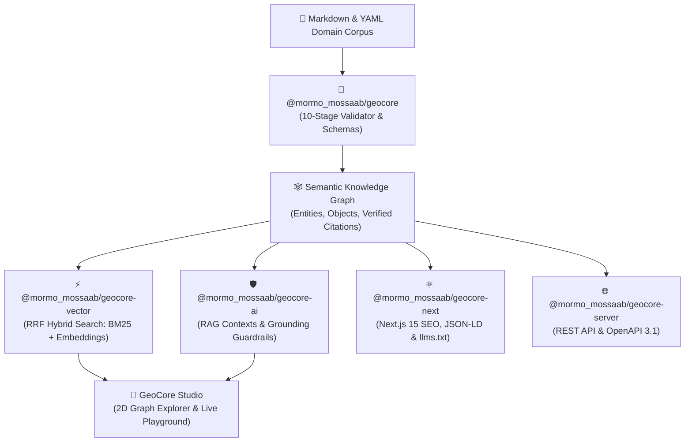

# 💼 LinkedIn Authority & Launch Posts Kit

> **Target Audience**: Tech Founders, CTOs, MedTech & HealthTech leaders, AI Engineers, and Healthcare innovators.  
> **Strategy**: Establish Dr. Mossaab Rtimi as a thought leader at the intersection of **Clinical Dentistry / Healthcare** and **Software Development / AI Systems**, where reliability and zero hallucinations are non-negotiable.

---

## 📌 Post 1: The Founder Story (Storytelling & Problem Hook)

**Hook**: As a dental surgeon (chirurgien-dentiste) who develops software, I watched general AI tools give dangerously confident advice on clinical topics. Here is why we built a cure for AI hallucinations.

```markdown
As both a dental surgeon (Doctor of Dental Surgery) and a software developer, I live at the intersection of two very different worlds:

In clinical practice and surgery, an error of 1% can have irreversible clinical consequences.
In generative AI, an error rate of 1% is often dismissed as "the model having a creative moment."

When companies try to build AI assistants for healthcare, clinical dentistry, or regulated industries, they quickly realize:
❌ Basic vector search misses exact medication names, clinical dosages, and ISO codes.
❌ Standard RAG systems hallucinate answers because there are no strict citation guardrails.
❌ Documentation is scattered across PDFs, Notion pages, and markdown files with broken links.

To fix this fundamental reliability gap, I created **GeoCore** — an open-source, AI-Native Knowledge Operating System (Knowledge OS).

🧠 What GeoCore does:
1️⃣ **Zero Hallucination Guardrails**: It deterministically verifies AI answers against certified evidence (PubMed, WHO, HAS, ISO) and computes a clinical hallucination risk score before reaching the user.
2️⃣ **Pure TypeScript Hybrid Search (RRF)**: Merges lexical keyword precision (BM25) with dense vector embeddings in under 2ms.
3️⃣ **10-Stage Knowledge Validation**: Compiles raw Markdown & YAML files into a connected, type-safe knowledge graph.
4️⃣ **Omnichannel AI Distribution**: Automatically generates static web pages, Schema.org microdata, and standard `llms.txt` files for AI search engines like Perplexity and ChatGPT Search.

Today, GeoCore is 100% open-source under the MIT license, backed by 105 test suites and 747 automated tests.

Try the interactive visual studio with one command:
👉 `npx @mormo_mossaab/geocore-cli init my-kb && npx @mormo_mossaab/geocore-cli studio`

🔗 GitHub Repository: https://github.com/mormox2/GeoCore

I'd love to hear from other tech leaders and healthcare innovators: how are you solving the AI trust problem in your domain?

#ArtificialIntelligence #HealthTech #OpenSource #TypeScript #RAG #MachineLearning #WebDevelopment #SoftwareEngineering
```

---

## 📌 Post 2: Technical Deep Dive (Why Vector Search Alone Fails)

```text
Why 80% of RAG projects fail in high-stakes domains (and how Reciprocal Rank Fusion solves it) ⬇️

When you search for a generic concept like "how to improve digestion," vector search (cosine similarity on dense embeddings) works great.

But in real-world professional domains:
🔍 A doctor searches for "Amoxicillin 500mg clavulanate"
🔍 A compliance officer searches for "ISO 22000:2018 Section 8.5"
🔍 An engineer searches for a specific error code "ERR_0x4F92"

Standard vector embeddings compress meaning into a continuous space. But for precise acronyms, numbers, and identifiers, semantic compression is an enemy.

This is why we implemented Reciprocal Rank Fusion (RRF) in pure TypeScript for GeoCore:

💡 RRF Score = (Lexical Weight / (60 + Lexical Rank)) + (Vector Weight / (60 + Vector Rank))

By combining the deterministic exact-match power of BM25 with dense cosine vectors:
✅ You never miss exact IDs or medical terminology.
✅ You capture conversational natural language queries.
✅ Latency remains under 2ms directly in-memory without external database bloat.

GeoCore is open-source on GitHub: https://github.com/mormox2/GeoCore

Have you transitioned your RAG pipeline from pure vector to hybrid search? What challenges did you face?

#RAG #Search #AI #VectorSearch #BM25 #Fullstack #DevCommunity
```

> 💡 **Visuel recommandé à joindre au post** :
> 1. Vous pouvez copier le code TypeScript ci-dessous et le coller dans [Ray.so](https://ray.so) ou [Carbon.now.sh](https://carbon.now.sh) pour générer en 5 secondes une image de code ultra-élégante (thème sombre, gradient violet/bleu).
> 2. **Extrait de code TypeScript à coller :**

```typescript
// ⚡ Pure TypeScript Hybrid Search (BM25 + Dense Vectors via RRF)
// Latence < 2ms en mémoire — Zéro dépendance Python ou base externe

export function computeRRF(
  lexicalHits: SearchResult[],
  vectorHits: VectorHit[],
  k = 60,
  wLex = 1.0,
  wVec = 1.0
): RankedResult[] {
  const scores = new Map<string, RankedResult>();

  // 1. Score des correspondances exactes (BM25)
  lexicalHits.forEach((hit, index) => {
    const rank = index + 1;
    const rrfScore = wLex / (k + rank);
    scores.set(hit.id, { ...hit, rrfScore, lexicalRank: rank });
  });

  // 2. Fusion des vecteurs denses (Cosine Similarity)
  vectorHits.forEach((hit, index) => {
    const rank = index + 1;
    const rrfContribution = wVec / (k + rank);
    const existing = scores.get(hit.id);

    if (existing) {
      existing.rrfScore += rrfContribution;
      existing.vectorRank = rank;
      existing.matchType = "hybrid-both"; // Exact + Sémantique
    } else {
      scores.set(hit.id, {
        ...hit,
        rrfScore: rrfContribution,
        vectorRank: rank,
        matchType: "semantic-only",
      });
    }
  });

  // 3. Tri déterministe par score RRF fusionné
  return Array.from(scores.values()).sort((a, b) => b.rrfScore - a.rrfScore);
}
```

---

## 📌 Post 3: Open-Source Milestone & Community Invitation

```text
🚀 Excited to announce the official v1.0.0 release of GeoCore — the AI-Native Knowledge Operating System!

What started as an internal tool to ensure 100% factual accuracy in medical and technical knowledge bases has evolved into a complete 7-package TypeScript monorepo:

📦 @mormo_mossaab/geocore — Domain Core, Schemas & Static Exporters
🛠️ @mormo_mossaab/geocore-cli — Command line toolkit & Interactive Studio
⚡ @mormo_mossaab/geocore-vector — Pure TS Hybrid Search (RRF) & Embeddings
🛡️ @mormo_mossaab/geocore-ai — RAG context generator & Hallucination Guardrails
🌐 @mormo_mossaab/geocore-server — Standalone REST API with dynamic OpenAPI 3.1
⚛️ @mormo_mossaab/geocore-next — Next.js 14/15 App Router SEO & llms.txt handlers
💾 @mormo_mossaab/geocore-db — In-Memory & SQLite persistence layer

📊 Validated by 105 test suites and 747 automated tests (100% pass rate).

Explore the code, star the repo, and build your own hallucination-free knowledge base:
⭐ https://github.com/mormox2/GeoCore

#OpenSource #TypeScript #Nextjs #AI #SoftwareArchitecture #DeveloperTools #HealthTech
```

> 💡 **Visuel d'architecture recommandé à joindre au Post 3** :  
> Les développeurs adorent les schémas d'architecture ! Vous pouvez coller le code Mermaid ci-dessous dans [Mermaid.live](https://mermaid.live) ou [Eraser.io](https://eraser.io) pour exporter un schéma haute résolution :


