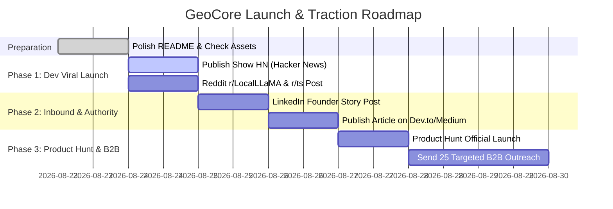

# 🚀 GeoCore — Master Launch & User Acquisition Toolkit

Welcome to the **GeoCore Launch & User Acquisition Suite**. This directory contains ready-to-use, copy-paste assets designed to generate immediate traction, attract developer adoption, gain GitHub stars, and acquire B2B enterprise leads.

---

## 📂 Launch Kit Assets Overview

| Asset Document | Target Audience | Primary Goal |
|---|---|---|
| [`01_HACKER_NEWS_SHOW_HN.md`](./01_HACKER_NEWS_SHOW_HN.md) | Hacker News (Y Combinator) | Drive massive global developer traffic, feedback & GitHub stars. |
| [`02_REDDIT_COMMUNITY_POSTS.md`](./02_REDDIT_COMMUNITY_POSTS.md) | `r/LocalLLaMA`, `r/typescript`, `r/nextjs` | Deep technical engagement with AI engineers & web developers. |
| [`03_LINKEDIN_AUTHORITY_STRATEGY.md`](./03_LINKEDIN_AUTHORITY_STRATEGY.md) | LinkedIn Tech & Healthcare Ecosystem | Position Dr. Mossaab Rtimi as a medical + AI authority. |
| [`04_PRODUCT_HUNT_LAUNCH_KIT.md`](./04_PRODUCT_HUNT_LAUNCH_KIT.md) | Product Hunt Community | Win "Top Product of the Day" in Developer Tools / AI. |
| [`05_B2B_OUTREACH_PLAYBOOK.md`](./05_B2B_OUTREACH_PLAYBOOK.md) | MedTech / LegalTech / B2B SaaS CTOs | Book discovery calls for free Knowledge Audits & PoCs. |
| [`06_DEVTO_MEDIUM_TECHNICAL_ARTICLE.md`](./06_DEVTO_MEDIUM_TECHNICAL_ARTICLE.md) | Dev.to, Hashnode, Medium, Substack | Long-tail inbound SEO and thought leadership. |

---

## 🗓️ 7-Day Execution Calendar

### Day 1 (Monday / Tuesday): The Dev Inbound Kickoff
1. Post **Show HN** on Hacker News ([`01_HACKER_NEWS_SHOW_HN.md`](./01_HACKER_NEWS_SHOW_HN.md)) around 14:00 UTC (9:00 AM EST).
2. Share the technical breakdown on **Reddit** `r/LocalLLaMA` and `r/typescript` ([`02_REDDIT_COMMUNITY_POSTS.md`](./02_REDDIT_COMMUNITY_POSTS.md)).
3. Monitor comments actively during the first 4 hours to answer technical questions promptly.

### Day 2 (Wednesday): Authority & Thought Leadership
1. Post the Founder Story on **LinkedIn** ([`03_LINKEDIN_AUTHORITY_STRATEGY.md`](./03_LINKEDIN_AUTHORITY_STRATEGY.md)).
2. Publish the technical article on **Dev.to / Hashnode / Medium** ([`06_DEVTO_MEDIUM_TECHNICAL_ARTICLE.md`](./06_DEVTO_MEDIUM_TECHNICAL_ARTICLE.md)).

### Day 3 (Thursday): Product Hunt Launch Day
1. Submit GeoCore on **Product Hunt** at 12:01 AM PST ([`04_PRODUCT_HUNT_LAUNCH_KIT.md`](./04_PRODUCT_HUNT_LAUNCH_KIT.md)).
2. Pin the Maker Comment.
3. Share the Product Hunt link with your network and developer communities.

### Day 4-5 (Friday - Weekend): Direct B2B Outreach
1. Identify 20-30 MedTech, HealthTech, or B2B SaaS CTOs on LinkedIn.
2. Send the customized outreach message proposing a free **30-minute Knowledge & Hallucination Audit** ([`05_B2B_OUTREACH_PLAYBOOK.md`](./05_B2B_OUTREACH_PLAYBOOK.md)).

---

## 📊 Key Traction Metrics to Track

- ⭐ **GitHub Stars** (Target: 100+ in week 1)
- 📦 **NPM Weekly Downloads** for `@mormox2/geocore-cli` and `@mormox2/geocore`
- 💬 **HN / Reddit Comments & Upvotes**
- 🤝 **Inbound B2B Inquiries & Discovery Calls**
